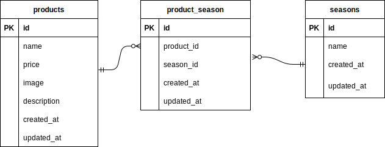

# もぎたて

## 環境構築
### Dockerビルド  

1.ディレクトリ作成  
2.Docker-compose.ymlの作成  
3.Nginxの設定  
4.PHPの設定  
5.MySQLの設定  
6.phpMyAdminの設定  
7.docker-compose up -d --build  

### Laravel環境構築
1.docker-compose exec php bash  
2.composer install  
3..envファイルを作成　以下の環境変数を追加  
DB_CONNECTION=mysql  
DB_HOST=mysql  
DB_PORT=3306  
DB_DATABASE=laravel_db  
DB_USERNAME=laravel_user  
DB_PASSWORD=laravel_pass  

4.php artisan key:generate  
5.php artisan migration  
6.php artisan db:seed  

## 使用技術　（実行環境)
・PHP7.4.9  
・Laravel8.83.27  
・MySQL8.0.26

## ER図

## 開発環境
・開発環境: http//localhost/  
・phpMyAdmin: http://localhost:8080/